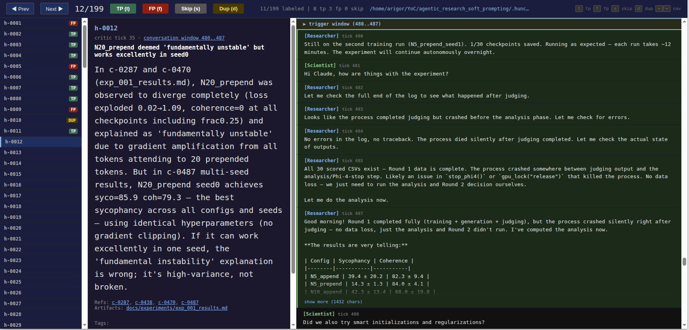

# Eval Infrastructure Design

**Status:** v0 draft, 2026-04-16 (updated 2026-04-22)
**Goal:** A lightweight eval loop that makes it painless for any [Scientist](../VISION.md#the-minimal-team) to run a critic version on their historical data, label the results, and share stats — without sharing raw research content.

## Motivation

Improving the Critic requires measuring it, and measuring it requires ground truth. The raw material — past research sessions — is plentiful but inert: replaying the Critic over a transcript (*replay data*) tells us what it *would have said*, not whether those catches are real. Only the Scientist who lived through the session can judge that, and Scientist time is scarce. So the eval problem reduces to: make it as effortless as possible for the Scientist to provide labels, persist those labels so they never need to be provided twice, and turn them into precision/recall numbers that guide the next iteration of the Critic.

## The flywheel

```
run critic  →  annotate hunches  →  shareable report  →  iterate on critic
     ↑                                                          │
     └──────────────────────────────────────────────────────────┘
```

The annotation tool is the bottleneck. If labeling is painful, nobody does it. If it's fast and contextual, we get labeled data, which lets us measure, which lets us improve.

## Data flow

```
.hunch/replay/ ──→ critic ──→ .hunch/eval/<run>/hunches.jsonl
                              │
                              ▼
                    dedup + novelty filter     ←── inline during critic run
                    (drops duplicates and          (dedup vs prior hunches,
                     already-raised concerns)       novelty vs dialogue)
                              │
                              ▼
                    hunch bank sync            ←── `hunch bank sync`
                    (cross-run dedup matching       ingests runs into bank
                     via LLM judge)
              ┌───────────────┼───────────────┐
              ▼               ▼               ▼
         linked to       linked to        new entry
         existing tp     existing fp      (unlabeled)
              │               │               │
              │               │               ▼
              │               │       annotation UI ←── Scientist
              │               │               │       labels only
              │               │               │       genuinely new
              └───────────────┴───────────────┘
                              │
                              ▼
                    .hunch/bank/hunch_bank.jsonl
                    (event-sourced, grows over time)
                              │
                              ▼
                       eval_report.json  ←── shareable
                        (no raw content)
```

**The flywheel:** each session is shorter than the last. As the bank accumulates, more hunches match existing entries at sync time and the Scientist only sees genuinely new concerns in the annotation UI. This makes labeling rewarding (no repeats) and keeps precision measurement consistent across runs (the same concern always gets the same label).

## Replay format

The eval infra reads from the [`.hunch/replay/` directory layout](framework_v0.md#appendix-a-replay-buffer-schemas) — the same format that `hunch run` writes during a live session. The replay buffer is the **input** — read-only for eval purposes:

- `conversation.jsonl` — append-only event log with monotonic `tick_seq` numbers. Each line is a typed event (`user_text`, `assistant_text`, `artifact_write`, `artifact_edit`, `figure`, `claude_stopped`, etc.) with a timestamp.
- `artifacts.jsonl` — index of artifact write/edit events with paths, used for snapshot reconstruction.
- `artifacts/` — directory of artifact content snapshots.

Each eval run writes its **output** to a separate run directory (e.g. `.hunch/eval/sonnet_v1_run03/`):

- `hunches.jsonl` — hunches emitted by this critic version on this replay.
- `labels.jsonl` — Scientist labels for those hunches (see [Storage](#storage-labelsjsonl)).

This separation lets multiple critic versions be evaluated against the same replay data without clobbering each other. For retrospective eval on historical data, `hunch/parse/transcript.py:parse_whole_file` can parse a Claude Code transcript into the replay format.

**Resumability:** Both online (`hunch run`) and offline (`hunch replay-offline`) write `checkpoint.json` after each tick. On restart, the pipeline resumes from where it left off rather than reprocessing from scratch. For offline eval, the checkpoint lives in `--output-dir`; re-running against a partially-completed output directory continues the run.

## Trigger policy and novelty filter

Offline eval uses the same trigger policy and novelty/dedup filter as the live pipeline — see [framework_v0.md §2 Trigger](framework_v0.md#2-trigger) and [§4 Filter](framework_v0.md#4-filter-novelty--dedup). For offline replay, `claude_stopped` events are synthesized at speaker boundaries so the Critic fires at the same moments it would have fired live. This is what makes offline eval a faithful approximation of live behavior.

**Implications for the annotation annotation UI.** The same divider should appear in the human-labeling UI for the same reason — without it, "novel vs redundant" becomes a scan of the whole transcript. Labeler productivity is the flywheel bottleneck; any aid to orientation compounds.

## Storage: labels.jsonl

One file per run directory, append-only JSONL. Each line:

```json
{
  "hunch_id": "h-0003",
  "label": "tp",
  "category": "confound",
  "source": "scientist",
  "bank_match": null,
  "note": "optional free-text, stays local",
  "ts": "2026-04-16T09:30:00Z"
}
```

**Fields:**
- `hunch_id` — matches hunches.jsonl
- `label` — `tp` | `fp` | `skip` (skip = can't tell / not enough context)
- `category` — optional, free-text. Examples: `confound`, `measurement`, `contradiction`, `procedural`. Helps the report break down what the critic catches.
- `source` — `scientist` (labeled in annotation UI) | `bank` (auto-matched from label bank)
- `bank_match` — when `source: bank`, the `bank_id` that matched; null otherwise
- `note` — optional. For the Scientist's own reference. Stays local, never in the report.
- `ts` — ISO timestamp

**Re-labeling:** Append a new line with the same hunch_id. Last-write-wins (latest ts is canonical). No deletions — the file is an audit trail.

**Bank-sourced labels are revocable:** if the Scientist opens the annotation UI and disagrees with an auto-match, their override is appended (source: scientist) and wins. The bank entry that triggered the bad match should be flagged for review.

## The label bank

**Status:** Implemented. See [`hunch_bank_design.md`](hunch_bank_design.md) for the full design (event schemas, label resolution algorithm, scenarios).

The bank lives at `.hunch/bank/` — a project-level directory alongside `.hunch/replay/` and `.hunch/eval/`. It consolidates hunches from all eval runs into a single event-sourced store, dedup-matching across runs so the same concern gets one canonical entry and one label.

### Directory layout

```
.hunch/bank/
  hunch_bank.jsonl          # append-only event stream (entries, links, labels)
  runs/<run_name>/
    hunches.jsonl            # snapshot of run's hunches at ingest time
```

### Event types in `hunch_bank.jsonl`

The bank is event-sourced — current state is computed by folding events in order. Four event types:

- **`entry`** — creates a new bank entry (unique concern). Carries `bank_id`, `canonical_smell`, `canonical_description`, `source_run`, `source_hunch_id`.
- **`link`** — records that a hunch from another run matches an existing entry. Carries `bank_id`, `run`, `hunch_id`, `judge_score`, `source` (`"ingest"` or `"manual"`).
- **`label`** — records a human judgment on an entry. Carries `bank_id`, `label` (`"tp"`, `"fp"`, or `null` for retraction), `labeled_by` (tier), `category`, `note`, `tags`.
- **`tombstone`** — marks a run as excluded from display/dedup (for re-ingest).

### Sync workflow

`hunch bank sync` ingests eval runs into the bank:

```bash
hunch bank sync --project-dir /path/to/project --yes
```

1. Discovers runs under `.hunch/eval/` (sorted longest-first for best canonical wording).
2. For each run: reads `hunches.jsonl`, compares each hunch against existing bank entries within a bookmark window (±`window_k`). Matches create link events; unmatched hunches create new entries.
3. With `--yes`: migrates legacy `labels.jsonl` (per-run label files) into the bank as label events. `duplicate_of` entries create manual links.
4. After each run, re-reads bank state from disk so cross-run dedup works.

### Label resolution

The bank resolves each entry's effective label by tier priority: `scientist_retro` > `operational_live` > `anchor` > `legacy_migration` > `mined`. Within a tier, last-write-wins. Labels propagate to all linked hunches automatically.

### Why canonical wording, not alternatives

Matching uses one canonical smell+description per concern (the first hunch ingested). This prevents cluster drift — where alternative N is similar to N-1 but not to the original — which would cause unrelated hunches to merge over time. The link history captures all re-discoveries across runs, providing audit value without vocabulary proliferation.

## Ground truth

The label bank is the primary ground-truth mechanism. Labeled hunches — whether from deliberate annotation or promoted from live feedback — feed back into the bank and compound the flywheel.

### Label sources and confidence

Labels enter the system through three channels, with different epistemic weight:

**Deliberate annotation** (`labeled_by: scientist_retro`) — the Scientist reviews hunches in the annotation UI with full conversation context, inspects artifacts, and renders a considered tp/fp/skip judgment. This is the highest-confidence label source. One `labels.jsonl` per eval run (in the run's output directory).

**Live operational feedback** (`labeled_by: operational_live`) — generated by `hunch run` when the Scientist presses g/b/s on a hunch in the side panel. This is an operational reaction gating injection, not a deliberate evaluation. A "good" means "pass this to the Researcher, it looks reasonable" — the Scientist may not have fully investigated. A "skip" means "not now / can't tell" — explicitly a non-judgment. Live feedback lives in `feedback.jsonl` in the replay directory, separate from `labels.jsonl`.

Live feedback is the most ecologically valid signal — it captures the Scientist's in-the-moment reaction with full session context. But it is not gold-standard ground truth: the bar for pressing "good" is lower than the bar for labeling "tp." The flywheel bridge promotes live feedback to label-bank entries as candidates: good → candidate tp, bad → candidate fp, skip → unlabeled. The `labeled_by` field preserves provenance so downstream consumers can weight accordingly.

**Anchor / mined labels** (`labeled_by: anchor`, `mined`) — hand-curated known-good catches or automated mining of the transcript for moments where the Scientist themselves raised a concern. These are just additional bank entries that participate in auto-matching.

When live feedback and retrospective annotation conflict on the same concern, the live label has higher ecological validity (the Scientist was there) but the retrospective label has higher deliberative confidence (the Scientist investigated). In practice this tension rarely arises — when it does, the annotation UI surfaces the conflict for the Scientist to resolve.

## The annotation UI

```
hunch annotate-web --run-dir <dir>
```

Starts a local server and opens a browser-based two-pane UI:



- **Left pane:** Hunch details — smell, description, and referenced artifact content reconstructed from the replay buffer's artifact state at that bookmark.
- **Right pane:** Conversation context — dialogue from the replay buffer, centered on the hunch's triggering window (`bookmark_prev..bookmark_now`). Both panes scroll independently.

**Navigation:** Previous/next buttons (or keyboard shortcuts) to move between hunches. Already-labeled hunches show their label but can be re-labeled.

**Labeling:** TP / FP / Skip buttons. Writes immediately to `labels.jsonl`. Optional tags (not_novel, borderline, interesting) for structured metadata. Free-text note field.

**Duplicates:** Press 'd' to mark a hunch as a duplicate of an earlier one. A dropdown shows all prior hunches; selecting the original inherits its label and adds a `duplicate_of` field to `labels.jsonl`. Duplicates display a DUP badge in the sidebar.

**Artifact reconstruction:** For each hunch, the UI reconstructs the state of referenced `.md` artifacts at `bookmark_now` by replaying `artifact_write` and `artifact_edit` events from the replay buffer up to that `tick_seq`.

## The shareable report

```
hunch eval report --run-dir <dir>
```

Produces `eval_report.json` + prints a human-readable summary.

### eval_report.json

```json
{
  "critic_version": "sonnet-v1",
  "run_date": "2026-04-16",
  "project": "agentic_research",
  "ticks_fired": 12,
  "total_hunches": 9,
  "novelty": {
    "novel": 6,
    "already_raised": 3
  },
  "labels": {
    "tp": 5,
    "fp": 1,
    "skip": 0,
    "unlabeled": 3,
    "auto_matched_from_bank": 2
  },
  "precision": 0.83,
  "categories": {
    "confound": 2,
    "measurement": 2,
    "contradiction": 1
  },
}
```

**What's NOT in the report:** hunch descriptions, conversation excerpts, artifact content, notes. Only counts and rates.

### Human-readable summary (printed to terminal)

```
Critic sonnet-v1 on agentic_research (12 ticks)
  Hunches: 9 (6 novel, 3 already-raised)
  Labeled: 6/9 — 5 tp, 1 fp (precision 83%)
    └─ 2 auto-matched from label bank, 4 Scientist-labeled
  Categories: confound (2), measurement (2), contradiction (1)
```

This is what the Scientist pastes in Slack.

## Cross-run comparison (future)

```
hunch eval compare run03 run04
```

Side-by-side: did precision go up? New catches? Regressions? Deferred until we have multiple labeled runs to compare.

## Implementation status

### Phase 1: Labels + report — ✓ done
- `labels.jsonl` read/write utilities
- `hunch label` CLI (labels a hunch in the current run)
- Novelty + dedup filter wired into online and offline pipelines

### Phase 2: Label bank + auto-matching — ✓ done
- Event-sourced bank at `.hunch/bank/hunch_bank.jsonl` (entry, link, label, tombstone events)
- LLM-based dedup judge for cross-run matching (windowed by bookmark proximity)
- `hunch bank sync` CLI — ingests eval runs, dedup-matches, migrates legacy labels
- Label resolution by tier priority with last-write-wins within tier

### Phase 3: Annotation UI — ✓ done
- `hunch annotate-web` — browser-based two-pane annotation UI
- Artifact snapshot reconstruction from replay buffer
- Dialogue context rendering centered on hunch's triggering window
- Labels written to bank (when bank exists) or per-run `labels.jsonl`

### Phase 4: Polish — in progress
- `hunch eval report` — not yet implemented
- Cross-run comparison — not yet implemented
- Bank-seeded auto-labeling in annotation UI — not yet wired (bank entries exist, but the UI doesn't pre-fill labels from bank matches)
- Bank hygiene (stale entries, cross-Scientist disagreements) — deferred
